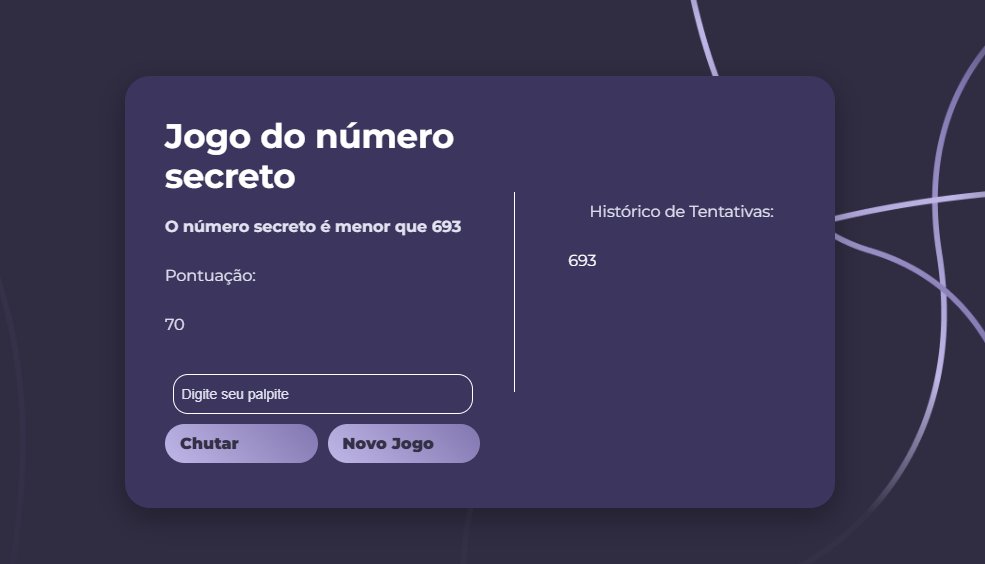

# Jogo do Número Secreto 🎲

Este projeto foi desenvolvido para a disciplina de **Lógica Aplicada** e consiste em um jogo de adivinhação de número secreto. Criado com **HTML**, **CSS** e **JavaScript**, o jogo desafia os jogadores a adivinhar o número correto com base em dicas matemáticas.

---

## 🌐 Teste o Jogo Agora!

O jogo está disponível online e pode ser acessado diretamente pelo link abaixo, sem a necessidade de clonar o repositório:

🔗 [Acesse o Jogo no Vercel](https://adivinhe-numero-blue.vercel.app/)

## 🎯 Como Jogar

1. Escolha um número entre **1 e 1000**.
2. Leia as dicas fornecidas para refinar seu palpite.
3. Digite o número no campo de entrada e clique em **Chutar**.
4. Continue tentando até acertar ou alcançar o limite de **7 tentativas**.
5. Ao final, confira sua pontuação e o número secreto, caso não tenha acertado.

---

## 🚀 Funcionalidades

- **Dicas Matemáticas:**  
  O jogo fornece dicas para ajudar o jogador, como:
  - O número secreto é múltiplo de X.
  - O número secreto é divisível por X.
  - O número secreto é ímpar/par.
  - O número secreto é um número primo.
  - O número secreto é um número cúbico.

- **Sistema de Tentativas:**
  - Os jogadores têm até **7 tentativas** para adivinhar o número.

- **Pontuação:**
  - O jogador começa com **70 pontos**.
  - Cada erro custa **10 pontos**.
  - Se o jogador não acertar após as 7 tentativas, a pontuação será **0**.

- **Histórico de Tentativas:**
  - Um painel registra e exibe as tentativas anteriores para ajudar o jogador a não repetir números.

- **Revelação do Número Secreto:**
  - Após o término do jogo, o número secreto é revelado, caso o jogador não o descubra.

---

## 📷 Demonstração

### Tela Inicial

### Tela do Jogo

---

## 🛠️ Tecnologias Utilizadas

- **HTML**: Estrutura da aplicação.
- **CSS**: Estilização e design responsivo.
- **JavaScript**: Lógica do jogo e manipulação de eventos.
- **Vercel**: Hospedagem do projeto na web.
